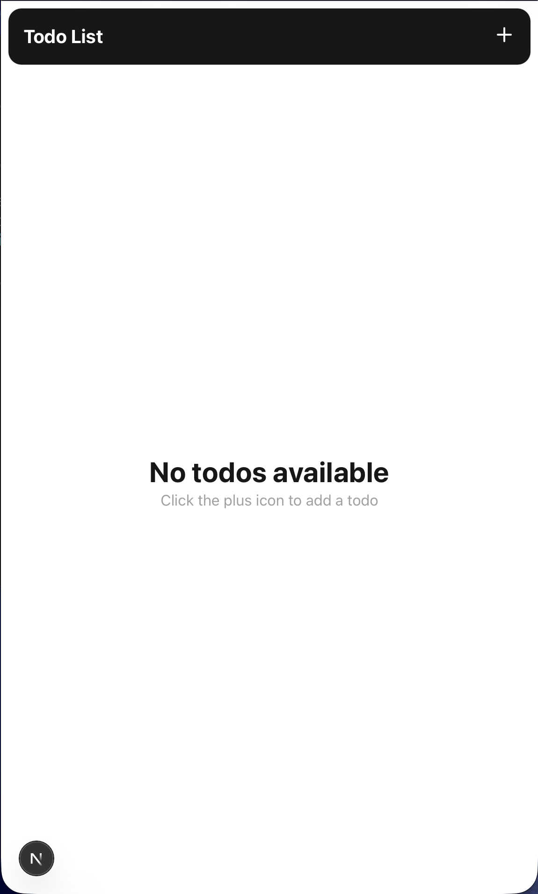
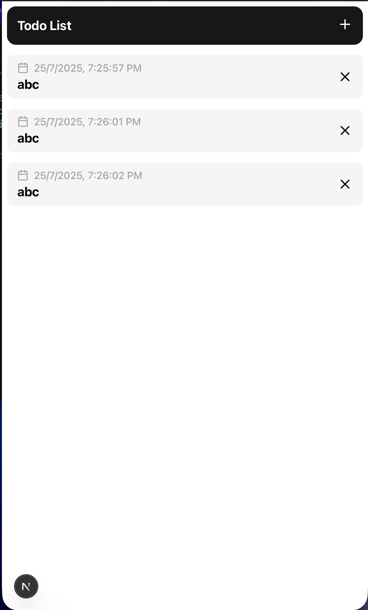

# Todo App

A clean and minimal **black and white themed Todo application** built with Next.js.

---

## Features

* Add Todo (Hardcoded Title for now)
* Delete Todo

---

## Roadmap

* [x] Add Todo
* [x] Delete Todo
* [x] Add input for dynamic todo titles
* [x] Edit todos
* [x] Database integration
* [x] Add Transitions

---

## Screenshots




---

## Getting Started

### 1. Clone the repository

```bash
git clone https://github.com/pratyakshkwatra/todo.git
cd todo
```

### 2. Install dependencies

```bash
npm install
```

### 3. Run the development server

```bash
npm run dev
```

Visit [http://localhost:3000](http://localhost:3000) to see the app.

---

## Contributing

Contributions are welcome! Open an issue to discuss ideas or submit a pull request.
